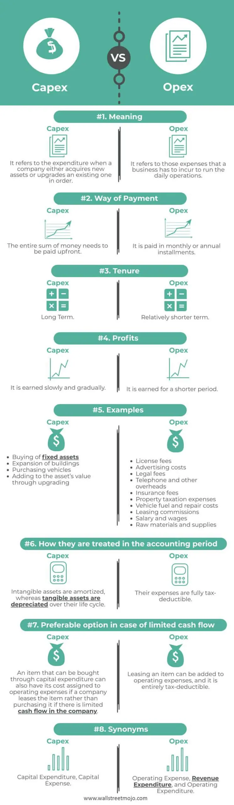

# What is Cloud computing

Definition:

    Cloud computing is a model for enabling ubiquitous, convenient, on-demand network access to a shared pool of configurable computing resources (e.g., networks, servers, storage, applications, and services) that can be rapidly provisioned and released with minimal management effort or service provider interaction. This cloud model is composed of five essential characteristics, three service models, and four deployment models.

NIST definition from [https://csrc.nist.gov/publications/detail/sp/800-145/final](https://csrc.nist.gov/publications/detail/sp/800-145/final) 

Currently, Amazon Web Services (AWS) is the largest provider of cloud computing services, offering a variety of cloud IT services in the form of infrastructure, platform, and software solutions. 

## On-premise vs Cloud

### What is On-Premises?

Referred to as on-premises or on-prem, this computing model consists of software downloaded to a physical device that the organization owns. People often use the term in reference to an organization’s data centers, including corporate-owned servers, networking systems, and system components. Additionally, on-premises can refer to internally designed applications specific to the organization’s use cases.

From [https://www.alertlogic.com/blog/on-premises-vs-cloud-whats-the-difference/](https://www.alertlogic.com/blog/on-premises-vs-cloud-whats-the-difference/)

### What is Cloud Computing?

Cloud computing is a model where another organization owns the servers, storage, databases, and software, delivering them “as-a-service” to customers. Instead of owning the hardware and software, the organization pays to use the services when it needs them.

### Comparison

Resource availability is the primary differentiation point between cloud and on-premises deployments.

- The cloud is **scalable** (a system’s ability to increase or decrease in performance and cost in response to changes in application and system processing demands). On-premises resources offer **finite** storage and compute power.
- Cloud resources use either a subscription-based or usage-based pricing model. On-premises resources are payed even when they are not used.
- Cloud offers different solutions for maintenance and management at low cost while on-prem resources need dedicated people to do this all the time.
- Cloud offers security experience and technology at low cost while on-prem resources need dedicated people to do this all the time. Cloud offers a shared-security model where clients are responsible for things done **in** the cloud and Cloud providers are responsible to secure **the** cloud.

## 6 advantages of the cloud computing

According to AWS there are six advantages of Cloud Computing:

1. **Trade fixed expense for variable expense** – Instead of having to invest heavily in data centers and servers before you know how you’re going to use them, you can pay only when you consume computing resources, and pay only for how much you consume.

Image from [https://www.wallstreetmojo.com/capex-vs-opex/](https://www.wallstreetmojo.com/capex-vs-opex/)

A common example of variable expenses is operational expenses (Opex) that may increase or decrease based on the business activity. 

2. **Benefit from massive economies of scale** – By using cloud computing, you can achieve a lower variable cost than you can get on your own. Because usage from hundreds of thousands of customers is aggregated in the cloud, providers such as AWS can achieve higher economies of scale, which translates into lower pay as-you-go prices.

3. **Stop guessing capacity** – Eliminate guessing on your infrastructure capacity needs. When you make a capacity decision prior to deploying an application, you often end up either sitting on expensive idle resources or dealing with limited capacity. With cloud computing, these problems go away. You can access as much or as little capacity as you need, and scale up and down as required with only a few minutes’ notice.

4. **Increase speed and agility** – In a cloud computing environment, new IT resources are only a click away, which means that you reduce the time to make those resources available to your developers from weeks to just minutes. This results in a dramatic increase in agility for the organization, since the cost and time it takes to experiment and develop is significantly lower.

5. **Stop spending money running and maintaining data centers** – Focus on projects that differentiate your business, not the infrastructure. Cloud computing lets you focus on your own customers, rather than on the heavy lifting of racking, stacking, and powering servers.

6. **Go global in minutes** – Easily deploy your application in multiple regions around the world with just a few clicks. This means you can provide lower latency and a better experience for your customers at minimal cost.

From [https://docs.aws.amazon.com/whitepapers/latest/aws-overview/six-advantages-of-cloud-computing.html](https://docs.aws.amazon.com/whitepapers/latest/aws-overview/six-advantages-of-cloud-computing.html)

## Five Essential Characteristics of the Cloud

1. **On Demand Self-Service**: A consumer can unilaterally provision computing capabilities, such as server time and network storage, as needed automatically without requiring human interaction with each service provider.
2. **Broad Network Access**: Capabilities are available over the network and accessed through standard mechanisms that promote use by heterogeneous thin or thick client platforms (e.g., mobile phones, tablets, laptops, and workstations).
3. **Resource Pooling**: The provider’s computing resources pooled to serve multiple consumers using a multi-tenant model, with different physical and virtual resources dynamically assigned and reassigned according to consumer demand.  There is a sense of location independence in that the customer generally has no control or knowledge over the exact location of the provided resources but may be able to specify location at a higher level of abstraction (e.g., country, state, or datacenter).  Examples of resources include storage, processing, memory, and network bandwidth.
4. **Measured/Metered**: Cloud systems automatically control and optimize resource use by leveraging a metering capability at some level of abstraction appropriate to the type of service (e.g., storage, processing, bandwidth, and active user accounts). Resource usage can be monitored, controlled, and reported, providing transparency for both the provider and consumer of the utilized service.
5. **Rapid Elasticity**: Capabilities can be elastically provisioned and released, in some cases automatically, to scale rapidly outward and inward commensurate with demand.  To the consumer, the capabilities available for provisioning often appear to be unlimited and can be appropriated in any quantity at any time.

## Scaling

### Scaling up aka vertical scaling 

Resources such as CPU, network, and storage are common targets for scaling up. In a hardware-centric world, this might mean adding a larger hard drive to a computer for increased storage capacity.  It might mean replacing the entire computer with a machine that has more CPU and a more performant network interface.

The goal is to increase the resources supporting your application to reach or maintain adequate performance.
Scaling up makes sense when you have an application that needs to sit on a single machine.

### Scaling out aka horizontal scaling

If you have an application that has a loosely coupled architecture, it becomes possible to easily scale out by replicating resources. 

## Three Service Models

1. **Infrastructure As a Service**: The capability provided to the consumer is to provision  
processing, storage, networks, and other fundamental computing resources were the  
consumer is able to deploy and run arbitrary software, which can include operating  
systems and applications. The consumer does not manage or control the underlying cloud 
infrastructure but has control over operating systems, storage, and deployed applications. 
and possibly limited control of select networking components (e.g., host firewalls).
2. **Platform As a Service**: The capability provided to the consumer is to deploy onto the cloud 
infrastructure consumer-created or acquired applications created using programming languages, libraries, services, and tools supported by the provider. The  consumer  does 
not manage or control the underlying cloud infrastructure including network, servers,  
operating systems, or storage, but has control over the deployed applications and possibly 
configuration settings for the application-hosting environment
3. **Software As a Service**: The capability provided to the consumer is to use the provider’s applications running on a cloud infrastructure.  The applications are accessible from various client devices through either a thin client interface, such as a web browser (e.g., 
web-based email), or a program interface. The consumer does not manage or control the underlying cloud infrastructure including network, servers, operating systems, storage, or even individual application capabilities, with the possible exception of limited user-
specific application configuration settings.

## Four Deployment Models
There are 4 cloud Deployment Models according to NIST:

1. **Private cloud**. The cloud infrastructure is provisioned for exclusive use by a single organization comprising multiple consumers (e.g., business units).  It may be owned, managed, and operated by the organization, a third party, or some combination of them, and it may exist on or off premises.
2. **Community cloud**.  The cloud infrastructure is provisioned for exclusive use by a specific community of consumers from organizations that have shared concerns (e.g., mission, security requirements, policy, and compliance considerations). It may be owned, managed, and operated by one or more of the organizations in the community, a third party, or some combination of them, and it may exist on or off premises.
3. **Public cloud**. The cloud infrastructure is provisioned for open use by the general public. It may be owned, managed, and operated by a business, academic, or government organization, or some combination of them.  It exists on the premises of the cloud provider.
4. **Hybrid cloud**. The cloud infrastructure is a composition of two or more distinct cloud infrastructures (private, community, or public) that remain unique entities, but are bound together by standardized or proprietary technology that enables data and application portability (e.g., cloud bursting for load balancing between clouds).  

Both "multi-cloud" and "hybrid cloud" refer to cloud deployments that integrate more than one cloud.
- **Hybrid cloud** blends two or more different deployment models (private, community, or public).
- **Multi-cloud** blends different clouds (Oracle, Azure, etc.) of the same type (private, community, or public).
